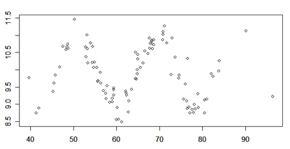
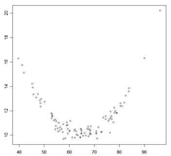
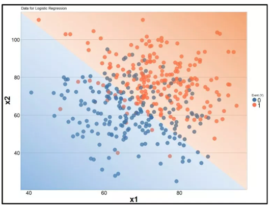
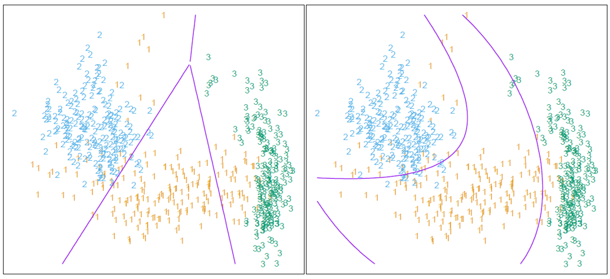
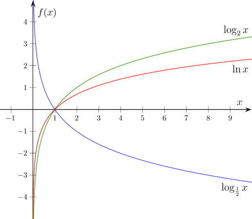
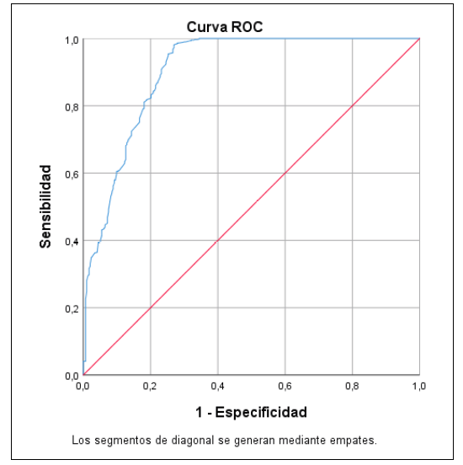

## Sobre Mi

<div style="text-align: justify;">

PhD en Estadística, MSc en Analytics & Big Data, MSc en Estadística. Con 20 años de experiencia, actual director de analítica en el CNC, miembro del comité de expertos en pobreza en el DANE y consultor de la División de Estadística de la CEPAL. Ex-decano de la Facultad de Estadística USTA, ex-director de operaciones en el ICFES, PM CEV ...

> Puedes encontrarme en:

-  [Google scholar](https://scholar.google.es/citations?user=2NJRNg8AAAAJ&hl=es)
-  [GitHub. https://github.com/jgbabativam](https://github.com/jgbabativam)
-  [linkedin](https://www.linkedin.com/in/giovany-babativa-marquez/?originalSubdomain=co)
-  j.babativamarquez@uniandes.edu.co

</div>

## Proceso de analítica


```{r, out.width= '100%'}
knitr::include_graphics(here::here("images/Ciclo.png"))
```
[Wickham, H. y otros (2023)](https://r4ds.hadley.nz/)

# MÉTODOS MULTIVARIANTES {background-color="#0077b6"}

## Modelos de analítica

```{r,  out.width= '110%'}
knitr::include_graphics(here::here("images/Metodos.png"))
```

## Modelando datos

Primero explore los datos para identificar el tipo de relación: lineal o no lineal.


. . .


{fig-align="center"}

. . .


Correlación de Pearson, gráficos de dispersión simples o matricial.


## Correlación lineal

{fig-align="center"}

## Otros tipos de asociación

Una Correlación de **CERO** no debe interpretarse como "No existe asociación", solo permite concluir que no hay asociación **lineal** pero puede existir una relación de otro tipo. Por ejemplo, Salario Vs. Experiencia. Otro aspecto a considerar es la presencia de datos atípicos ("raros") que puedan ser influyentes.


{fig-align="left"}
{fig-align="right"}

## Especificación del modelo

<div style="margin-top: 2cm"></div>


{fig-align="center"}

## ¿Es un buen modelo?

<div style="margin-top: 2cm"></div>

{fig-align="center"}

## Análisis de los residuales

<div style="margin-top: 2cm"></div>

{fig-align="center"}

## Pronósticos

<div style="margin-top: 2cm"></div>

{fig-align="center"}

## Algoritmos

Algunos modelos son:

- Lineales: `lm()`.

- Generalizados: `glm()`.

- Bayesianos: `stan_glm()`

- Penalizados: `glmnet()`

- ML: `tidymodels`

## Modelo Lineal

<div style="text-align: justify;">
Sea $\mathcal{D}=\{(y_i, \mathbf{x}_i): i=1,\ldots,n\}$, con $y_i$ la $i$-ésima respuesta medida en una escala continua; $\mathbf{x}_i=(x_{i1},\ldots,x_{ip})^t \in \mathbb{R}^p$ es el vector de variables predictoras; y $n$ $(\gg p)$ es el tamaño de la muestra. El modelo lineal se especifica así:
</div>

. . .

<br>

$$y_i = \beta_0 + \beta_1 x_{i1} + \cdots + \beta_p x_{ip} + \varepsilon_i \hspace{0.25cm} \text{con  } \varepsilon_i \overset{\text{iid}}{\sim} \mathcal{N}(0, \sigma^2)$$

# REGRESIÓN NO LINEAL {background-color="#0077b6"}

## Modelos de analítica

```{r,  out.width= '110%'}
knitr::include_graphics(here::here("images/Metodos.png"))
```

# MODELOS SUPERVISADOS DE CLASIFICACIÓN {background-color="#0077b6"}

## Modelos de respuesta discreta

Se usan cuando la variable dependiente es de tipo discreto, nominal o multinomial.

**Variable dependiente binaria**

- Aprobar/no aprobar el examen / gestión del pte. 

- Ser o no víctima de violencia doméstica. 

- Tener o no tener una enfermedad. 

- Estar o no en estado de pobreza. 

En este caso: 

$y_i \in \{0, 1\}$, en donde 1 representa aprobar y 0 no aprobar.

## Modelos de respuesta discreta

Se usan cuando la variable dependiente es de tipo discreto, nominal o multinomial.

**Variable dependiente nominal**

- Estado de ocupación: empleo formal, empleo informal, desempleo, inactivo, etc. 

- Clasificación étnica: Sin étnia, Afrocolombiano, Indígena, Raizal, Palenquero.

- Tipo de cliente: Élite, Plata, Bronce, Masivo.

En este caso: 

$y_i \in \{A, B, C, D, ...\}$, en donde cada letra representa una categoría nominal que es excluyente de las demás.

## Modelos de respuesta discreta

Se usan cuando la variable dependiente es de tipo discreto, nominal o multinomial.

**Variable dependiente ordinal**

- La clasificación del nivel de estrés en la escala: Sin estrés, con estrés leve, estrés moderado, estrés severo y estrés extremadamente severo. 

- Clasificación de pobreza: Con pobreza extrema, en estado de pobreza, no pobre. 

En este caso: 

$y_i \in \{1, 2, 3, ...\}$, en cada valor está en una escala ordinal.

## Regla de decisión

:::: {.columns}

::: {.column width="50%"}
<div style="margin-top: 0.5cm"></div>

{fig-align="left" style="font-size: 16px;"}
:::

::: {.column width="3%"}
<!-- columna vacía para crear un espacio -->
:::

::: {.column width="47%"}
- Necesitamos una regla para clasificar a cada observación. 

- La imagen presenta una regla dadas dos variables independientes.

- La función de clasificación puede ser lineal o no lineal.

:::

::::

## Regla de decisión

<div style="margin-top: 0.5cm"></div>

{fig-align="left" style="font-size: 18px;"}

# MODELO DE REGRESIÓN LOGÍSTICA {background-color="#0077b6"}

## Introducción

<div style="margin-top: 1.0cm"></div>

Suponga que puede clasificar a todas las observaciones en 2 grupos/clases (1: Éxito, 0: Fracaso). La función logística, permite calcular la probabilidad de cada suceso.

$$\pi(x) = P(Y = 1 | \mathbf{X}=\mathbf{x}) = \frac{\exp\{\beta_0+\beta_1x_1+\cdots+\beta_kx_k\}}{1+\exp\{\beta_0+\beta_1x_1+\cdots+\beta_kx_k\}} $$

. . .

$1-\pi(x)=P(Y = 0 | \mathbf{X}=\mathbf{x})$


<div style="margin-top: 0.5cm"></div>

¿Por qué no se debería aplicar regresión lineal en este caso?

## Riesgo (Odds)

$$Odds = \frac{\pi(x)}{1-\pi(x)}$$

. . .

Suponga que en el evento de desertar del colegio, se encontró que la probabilidad de deserción cuando el niño tiene una madre sin estudios es $\pi(x)=0.71$. Así que

$$Odds_{A} = \frac{0.71}{1-0.71} = 2.45$$

. . .

Por cada niño que no deserta, hay casi 3 que si lo hacen cuando la madre no tiene ningún nivel de estudios.


## Razón de Riesgos (Odds-Ratio - OR)

$$OR = \frac{Odds_A}{Odds_B}$$

. . .

Si la probabilidad de deserción cuando la madre tiene un nivel educativo de bachillerato es $\pi(x) = 0.18$. Calcule el OR entre el grupo con madre sin estudios y el grupo con madre con nivel de bachiller.

. . . 

$$OR = \frac{Odds_{\text{Madre sin estudios}}}{Odds_{\text{Madre bachiller}}} =  \frac{\frac{0.71}{1-0.71}}{\frac{0.18}{1-0.18}}=\frac{2.45}{0.22}=11.2$$

. . . 

Los  *odds* de deserción de un niño cuya madre no tiene estudios son 11.2 veces mayores que los *odds* de deserción de un niño cuya madre tiene un nivel de bachillerato.


## Modelo de regresión logística

Cuando la probabilidad se calcula con una f.d.p. logística, se puede mostrar que:


$$\frac{\pi(x)}{1-\pi(x)}=e^{\beta_0+\beta_1x_1+\beta_2x_2+\cdots+\beta_kx_k}$$

. . . 

De esta forma el log-odds, conocido como el logit, conlleva a una relación lineal fácil de manejar y de interpretar:

$$\ln\left(\frac{\pi(x)}{1-\pi(x)}\right) = \beta_0+\beta_1x_1+\beta_2x_2+\cdots+\beta_kx_k$$

## Aspectos técnicos

:::: {.columns}

::: {.column width="50%"}
Los parámetros se estiman por máxima verosimilitud. Como las ecuaciones de estimación no tienen una solución cerrada (una fórmula explícita como en MCO), se usan métodos iterativos:

- Newton – Raphson
- Descenso del gradiente
- Fisher
- Híbrido
:::

::: {.column width="3%"}
<!-- columna vacía para crear un espacio -->
:::

::: {.column width="47%"}
<div style="margin-top: 0.5cm"></div>

{fig-align="left"}
:::

::::

## Análisis exploratorio


```{r}
library(pacman)

p_load(tidyverse)

set.seed(123)
n <- 200
y <- rbinom(n, 1, 0.3) # 1 para violencia doméstica, probabilidad del 30%
x <- ifelse(y == 1, rpois(n, 6), rpois(n, 3)) # Frecuencia de consumo de alcohol

df <- data.frame(violencia_domestica = as.factor(y),
                 consumo_alcohol = x)

ggplot(df, aes(x = violencia_domestica, y = consumo_alcohol, 
               fill = violencia_domestica)) +
  geom_boxplot(outlier.colour = "red", 
               outlier.shape = 16, 
               outlier.size = 2) +
  scale_fill_manual(values = c("#E69F00", "#56B4E9")) +
  labs(title = "Relación entre la violencia doméstica y el consumo de alcohol",
       x = "Violencia Doméstica (1: Sí, 0: No)",
       y = "Frecuencia de Consumo de Alcohol") +
  theme_minimal(base_size = 15) +
  theme(legend.position = "none", 
        plot.title = element_text(hjust = 0.5, face = "bold"),
        axis.text.x = element_text(face = "bold", color = "black"),
        axis.text.y = element_text(face = "bold", color = "black"))
```

## Pruebas de hipótesis


{fig-align="center"}


## Prueba Chi-cuadrado

Permite identificar la asociación entre dos variables cualitativas.

- Fumar está asociado con el cáncer de pulmón
- El género está asociado con la preferencia por tipos de música
- El nivel educativo está asociado con la afiliación política
- El tipo de alimentación está asociado con la presencia de enfermedades cardíacas
- La deserción estudiantil está asociada con el nivel educativo de la madre/padre.
- Empleabilidad tras un programa de formación: Empleado después de la formación (Sí/No) vs Edad, nivel educativo, género, años de experiencia laboral...

## Prueba Chi-cuadrado

$$H_0:\text{Las variables son independientes}$$
$$H_1:\text{Las variables están relacionadas.}$$

. . . 

Si A y B son eventos independientes entonces se cumple que:

$$\mathbb{P}(A \cap B) = \mathbb{P}(A) * \mathbb{P}(B)$$

. . . 

Si el valor $p$ es inferior a un nivel $\alpha$ se dice que hay suficiente evidencia estadística para rechazar $H_0$.

## Desempeño del modelo: Matriz de confusión

<div style="margin-top: 1cm"></div>

```{r, out.width= '50%', dpi=600}
knitr::include_graphics(here::here("images/Logit4.png"))
```

**Sensibilidad**: Porcentaje de verdaderos positivos.

**Especificidad**: Porcentaje de verdaderos negativos.


## Desempeño del modelo: Curva ROC

Evalúa la capacidad predictiva del modelo. Se eligen varios puntos de corte y se representa gráficamente la capacidad del modelo para realizar una correcta clasificación

{fig-align="center"}

# ESTUDIO DE CASO {background-color="#0077b6"}

## DASS 21

- El instrumento del DASS 21 permite construir una escala de Depresión, Ansiedad y Estrés (DASS-21). Investigue más sobre su construcción y propiedades psicométricas. Una versión del instrumento puede ser consultada [aquí](https://la.konradlorenz.edu.co/wp-content/uploads/2025/09/dass-21-2.pdf)

- Explore el conjunto del datos `DASS21.sav` el cual contiene los resultados para una muestra de 800 personas de Colombia realizada en el año 2022.

```{r}
#| echo: true
library(pacman)
p_load(tidyverse, broom, modelr, haven, labelled, performance,
       skimr, corrplot, psych, gt, gtsummary, pROC, patchwork)

url <- "https://github.com/jgbabativam/AnaDatos/raw/main/datos/DASS21.sav"
dass <- read_sav(url)
```

Puede usar `lapply(dass, function(x) attributes(x)$label)` para ver las etiquetas de las preguntas.


## Variables del conjunto `DASS21` {.smaller}

| Variables | Descripción | Escala |
|:----------|:------------|:-------|
| `sexo` | Sexo | Hombre / Mujer |
| `P1_1` a `P1_6` | Satisfacción con: vivienda, trabajo, amigos, vecinos, barrio y familia | 1: Muy insatisfecho, ..., 5: Muy satisfecho (8: No tiene, se convierte en `NA`) |
| `P2_1` a `P2_8` | Participación en: actividades recreativas, culturales, socialización de experiencias, *coaching*, redes académicas, comunidades de aprendizaje, prácticas restaurativas y entrenamiento socioemocional | SÍ / NO |
| `P3_1` a `P3_7` | Frecuencia de actividades culturales, deportivas y de viajes | 1: Nunca, ..., 4: Mensual |
| `Item1` a `Item21` | Ítems del instrumento DASS-21 | 0 a 3 |
| `DEPRESION`, `ANSIEDAD`, `ESTRES` | Puntaje de cada escala | 0 a 21 |

## Factores de riesgo

En la escala de ansiedad del DASS-21, un puntaje de 8 o más corresponde a un nivel de **ansiedad severa o extremadamente severa** (ver la variable `Nivel_ANSIEDAD`).


Ajuste un modelo que le permita identificar los **factores de riesgo** y los **factores de protección** contra la ansiedad, para ello utilice las variables del sexo, satisfacción y participación que se encuentran dentro del instrumento aplicado.

## Factores de riesgo asociados a la ansiedad

<div style="margin-top: 2cm"></div>

```{r}
#| echo: true
prepara <- dass |> 
           mutate(ansi = ifelse(ANSIEDAD >= 8, 1, 0)) |> 
           mutate(sexo = as_factor(sexo),
                  across(starts_with("P1"), ~replace(., . == 8, NA)),
                  across(starts_with("P2"), ~relevel(as_factor(.), ref = "NO"))) |>
           drop_na(starts_with("P1")) 
```

<div style="margin-top: 1cm"></div>

Explore el conjunto de datos e identifique las diferencias frente a los datos iniciales. ¿Por qué se convierte la opción *No tiene* (código 8) en `NA`?

## Análisis exploratorio: Box-plot

```{r}
#| echo: true
#| fig.align: "center"
ggplot(prepara, aes(x = as.factor(ansi), y = P1_3, fill = as.factor(ansi))) +
  geom_boxplot() +
  labs(x = "Ansiedad (0 = No, 1 = Sí)", y = label_attribute(prepara$P1_3)) +
  ylim(1, 5) +
  theme_minimal() +
  theme(legend.position = "none") 
```


## Análisis exploratorio: Box-plot

```{r}
#| echo: true
#| eval: false
grafica <- function(variable) {
  label_y <- attr(prepara[[deparse(substitute(variable))]], "label")
  ggplot(prepara, aes(x = as.factor(ansi), y = {{variable}}, fill = as.factor(ansi))) +
    geom_boxplot() +
    labs(x = "Ansiedad (0 = No, 1 = Sí)", y = label_y) +
    ylim(1, 5) +
    theme_minimal() +
    theme(legend.position = "none") 
} 

p1 <- grafica(P1_1); p2 <- grafica(P1_2); p3 <- grafica(P1_3); 
p4 <- grafica(P1_4); p5 <- grafica(P1_5); p6 <- grafica(P1_6);

(p1 | p2 | p3)/(p4 | p5 | p6)
```

## Análisis exploratorio: Box-plot

```{r}
#| echo: false
grafica <- function(variable) {
  label_y <- attr(prepara[[deparse(substitute(variable))]], "label")
  ggplot(prepara, aes(x = as.factor(ansi), y = {{variable}}, fill = as.factor(ansi))) +
    geom_boxplot() +
    labs(x = "Ansiedad (0 = No, 1 = Sí)", y = label_y) +
    ylim(1, 5) +
    theme_minimal() +
    theme(legend.position = "none") 
} 

p1 <- grafica(P1_1); p2 <- grafica(P1_2); p3 <- grafica(P1_3); 
p4 <- grafica(P1_4); p5 <- grafica(P1_5); p6 <- grafica(P1_6);

(p1 | p2 | p3)/(p4 | p5 | p6)
```


## Análisis exploratorio: Prueba Chi-Cuadrado.

Esta prueba contrasta la hipótesis nula de independencia frente a la alternativa de asociación.

```{r}
#| echo: true
chisq.test(prepara$ansi, prepara$sexo)

attributes(dass$P2_7)$label
chisq.test(prepara$ansi, prepara$P2_7)
```

## Ajuste del modelo

<div style="margin-top: 2cm"></div>

```{r}
#| echo: true
modelo_logit <- glm(ansi ~ sexo + 
                          P1_1 + P1_2 + P1_3 + P1_4 + P1_5 + P1_6 +
                          P2_1 + P2_2 + P2_3 + P2_4 + P2_5 + P2_6 + P2_7 + P2_8, 
              data = prepara,
              family = binomial)
```

<div style="margin-top: 1cm"></div>

La función `glm()` permite ajustar un modelo lineal generalizado. Se usa `binomial` para modelos de regresión logística binaria donde la función de enlace es de tipo logit, cuando la variable dependiente son recuentos se usa `poisson` y si la variable dependiente es positiva continua entonces se puede usar `gamma`.

## Resultados

```{r}
#| echo: true
summary(modelo_logit)
```

Note que hay múltiples variables que no son significativas en el modelo.

## Modelo reducido

Para llevar a cabo un proceso de eliminación automática de variables que no son relevantes se puede usar

```{r}
#| echo: true
step(modelo_logit)
```

## Modelo final

<div style="margin-top: 2cm"></div>

```{r}
#| echo: true

var_label(prepara$P2_7) <- var_label(dass$P2_7)  
var_label(prepara$P2_8) <- var_label(dass$P2_8)

modelo_final <- glm(ansi ~ P1_2 + P1_4 + P1_6 + P2_7 + P2_8, 
                    data = prepara,
                    family = binomial)
```

## Resultados del modelo reducido

```{r}
#| echo: true
tbl_regression(modelo_final, exponentiate = TRUE) |> 
  bold_labels() 
```

## ¿La satisfacción con la familia es un factor de riesgo?

El OR de la satisfacción con la familia es mayor que 1. ¿Tiene sentido? Compare el OR sin ajustar con el OR del modelo final:

```{r}
#| echo: true
m_familia <- glm(ansi ~ P1_6, data = prepara, family = binomial)

bind_rows(tidy(m_familia, exponentiate = TRUE) |> mutate(Modelo = "Sin ajustar"),
          tidy(modelo_final, exponentiate = TRUE) |> mutate(Modelo = "Modelo final")) |>
  filter(term == "P1_6") |>
  select(Modelo, OR = estimate, `Valor p` = p.value) |>
  knitr::kable(digits = 3)
```

. . .

```{r}
#| echo: true
cor(prepara[c("P1_2", "P1_4", "P1_6")], method = "spearman") |> round(2)
```

## Efecto de supresión {.smaller}

- **Sin ajustar**, la satisfacción con la familia es protectora (OR < 1), aunque no es significativa.

- Las satisfacciones están **correlacionadas**. Al controlar por trabajo y vecinos, el coeficiente de familia mide cuánto más satisfecha con su familia está una persona **de lo que se esperaría** por su satisfacción en otros ámbitos.

. . .

- El OR ajustado se interpreta **manteniendo constantes las demás variables**: entre personas con igual satisfacción con el trabajo y los vecinos, más satisfacción con la familia se asocia con mayores *odds* de ansiedad severa.

. . .

> Una lectura posible: alguien insatisfecho con el trabajo y con los vecinos que dice estar muy satisfecho con su familia se parece más a quien tiene ansiedad. Puede ser porque se refugia en la familia o porque tiende a responder "muy satisfecho" en esa pregunta. Es un efecto condicional, no causal. En el modelo, trabajo y vecinos "absorben" la parte protectora que comparten con familia.

. . .

- **Cautela**: solo hay 43 casos de ansiedad severa, el 90 % responde 4 o 5 en esta pregunta, el valor p está en el límite y los valores p después de `step()` son optimistas.

## Predicción

<div style="margin-top: 2cm"></div>

```{r}
#| echo: true
#| eval: false
summary(modelo_final)
```

$$\ln\left(\frac{\pi}{1-\pi}\right)=-1.56 - 0.36 S.Trab - 0.50 S.Vec \\ \hspace{5cm} + 0.42 S.Flia + 1.53 P.Resta - 0.93 Hab.Soc$$
¿Cómo calcularía la probabilidad de que una persona con las siguientes características sufra de ansiedad severa? Sat.Trab = 1, Sat.Vec = 2, Sat.Flia = 3, Parti.Pract.Restau = Si, Entrenamiento SocEmo = No. ¿Qué se esperaría si la persona cambia a un trabajo que en verdad le haga muy feliz (5)?

## Curva ROC

```{r}
#| echo: true
predicciones <- predict(modelo_final, prepara, type = "response")
roc_curve <- roc(prepara$ansi, predicciones,  plot = TRUE, print.auc = TRUE)
```

# TALLER {background-color="#0077b6"}

## Taller 3: Regresión logística

Desarrolle el Taller 3 en los grupos de trabajo conformados. El taller tiene dos partes:

1. **Deserción escolar (ENDE - DANE)**: análisis exploratorio y pruebas Chi-cuadrado, modelo logístico del riesgo de deserción en función del índice de calidad de vida (ICV) y otras variables, interpretación de los OR y comparación de modelos con la curva ROC.

2. **Violencia contra las mujeres (Oxfam - Casa de la Mujer)**: pruebas Chi-cuadrado, selección de variables con `step()`, interpretación de los OR y pronóstico de la probabilidad de ser víctima de violencia sexual.

# GRACIAS! {background-color="#ddf3ff"}

# Referencias

- Çetinkaya-Rundel, M. and Hardin, J. (2021) Introduction to modern statistics. Sections of
Regression modeling: 7, 8, 9 y 10. Disponible aquí: https://openintro-ims.netlify.app/

- Hastie, T., Tibshirani, R., Friedman, J. H., & Friedman, J. H. (2009). The elements of statistical learning: data mining, inference, and prediction (Vol. 2, pp. 1-758). New York: springer.

- Ismay, C., & Kim, A.Y. (2019). Statistical Inference via Data Science: A ModernDive into R and the Tidyverse (1st ed.). Chapman and Hall/CRC. https://doi.org/10.1201/9780367409913

- Thompson, J. (2019). Tidy Data Science with the tidyverse and tidymodels. https://tidyds-2021.wjakethompson.com


